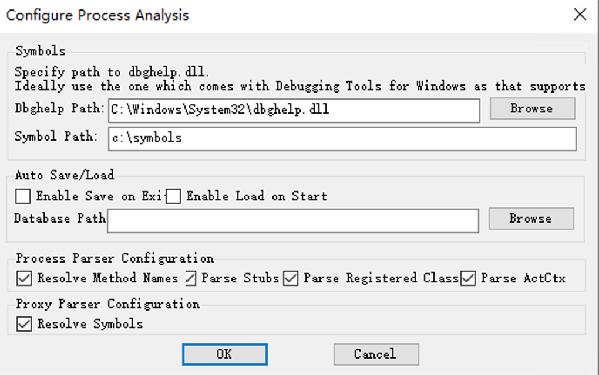
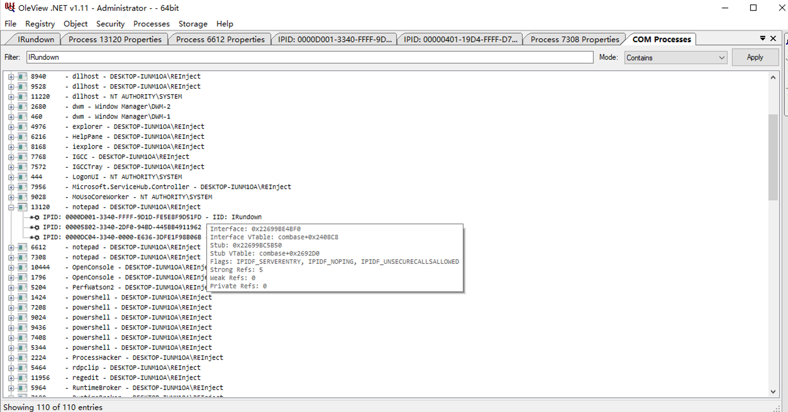

# COM-INJECT for RUST

Process Injection via Component Object Model (COM) IRundown::DoCallback().

该技术由 [@modexpblog](https://twitter.com/modexpblog) 挖掘发现，在我对该技术进行深入研究过程中，将原项目 [mdsecactivebreach/com_inject](https://github.com/mdsecactivebreach/com_inject) 使用了 Rust 重写，希望对使用 Rust 的安全人员在 COM 接口调用、进程注入等方面有所帮助。

对于此项注入技术原理的更保真的解释，还请参考 [https://www.mdsec.co.uk/2022/04/process-injection-via-component-object-model-com-irundowndocallback/](https://www.mdsec.co.uk/2022/04/process-injection-via-component-object-model-com-irundowndocallback/)，这里只记录一下工具用法和过程中遇到的一些问题和想法。

## 使用方法

```powershell
PS D:\rust\com-inject> .\target\release\com-inject.exe -h
com-inject (1.0) - REInject
A process injection tool via COM
Commands:
  inject  Inject special dll or shellcode to target process
  list    List interface instance in special or all process
  help    Print this message or the help of the given subcommand(s)

Options:
  -h, --help     Print help
  -V, --version  Print version

#############################################################
PS D:\rust\com-inject> .\target\release\com-inject.exe inject -h
Inject special dll or shellcode to target process

Usage: com-inject.exe inject [OPTIONS] <PID>

Arguments:
  <PID>  Target process id

Options:
  -m, --method            Use CoGetObject instead of CoUnmarshalInterface to establish channel
  -d, --dll <PATH>        Inject DLL into target, specify full path
  -s, --shellcode <PATH>  Inject shellcode into target process
  -h, --help              Print help

#############################################################
PS D:\rust\com-inject> .\target\release\com-inject.exe list -h
List interface instance in special or all process

Usage: com-inject.exe list [OPTIONS] [PID]

Arguments:
  [PID]  Target process id

Options:
  -v, --verbose  Dispaly all interface, default only IRundown
  -h, --help     Print help
```

> Tips:
>
> - DLL 和 Shellcode 文件路径使用绝对路径
> - 不论是 list 操作还是 inject 操作，都会尝试开启 DEBUG 权限
> - 避免对同一进程交替进行 DLL 注入和 shellcode 注入或者重复进行 DLL 注入，可能会报错 “被调用的对象已与其客户端断开连接。 (0x80010108)”，貌似是多次调用后远程接口会被释放掉
> - 如果报错 “不支持此接口 (0x80004002)”，就多试几遍
> - 并不是任何进程都能注入，只能对 list 动作显示出来的进程进行注入

## 技术原理

先说一下如何使用 Rust 对 COM 接口调用，调用过程可以分这几个步骤：

1. 接口定义
2. 调用 CoInitializeEx 初始化
3. 调用 CoGetObject 或其他类似 API 获取接口指针
4. 使用接口指针调用接口方法
5. 调用 CoUninitialize 结束

重点在接口定义，后面几步都是 API 调用，对于一些有文档记录的接口一般都有对应的头文件或 IDL，直接用就行，但是对于其他 COM 接口，调用之前先要定义一个包含方法虚表的结构体/接口，这个虚表的内存偏移、方法顺序需要保证和接口实现一致，后面拿到接口指针才能正确调用对应的方法，c++ 里的接口定义示例：

```cpp
const IID 
IID_IRundown = {
     0x00000134,
     0x0000,
     0x0000,
    {0xC0, 0x00, 0x00, 0x00, 0x00, 0x00, 0x00, 0x46}};
    
MIDL_INTERFACE("00000134-0000-0000-C000-000000000046")
IRundown : public IUnknown {
    STDMETHOD(RemQueryInterface)         ( REFIPID         ripid,
                                           ULONG           cRefs,
                                           USHORT          cIids,
                                           IID            *iids,
                                           REMQIRESULT   **ppQIResults);
                               
    STDMETHOD(RemAddRef)                 ( unsigned short  cInterfaceRefs,
                                           REMINTERFACEREF InterfaceRefs[],
                                           HRESULT        *pResults);
                               
    STDMETHOD(RemRelease)                ( USHORT          cInterfaceRefs,
                                           REMINTERFACEREF InterfaceRefs[]);
};
```

所有 COM 接口的祖先就是 IUnknown，大部分接口直接继承自 IUnknown，还有部分通过继承 IDispatch 或其他接口间接的继承自 IUnknown。继承在内存布局上实际上就是在父类的内存结构基础上进行新增，所以不继承直接将 IUnknown 中的方法搬过来也行。

由于 Rust 里面接口、类全部都以 struct 的形式表达，并且和 C++ 中的 struct 内存布局是有区别的，所以在定义接口虚表时，全部需要加上 `#[repr(C)]`，代表该结构体内存布局和 C 完全一致。C 里面有 `IUnknown`，Rust 里也不需要我们从 `IUnknown` 开始实现，实际上在 windows-rs 和 winapi 这两个 crate 中都有实现，但是实现方式上有所不同。主要体现在对 “接口指针” 的定义上，下面是使用 C、winapi、windows-rs 各自如何声明一个接口指针变量：

||声明方式|
|:--|:--|
|C|IUnknown *p = NULL;|
|winapi|let p: *mut IUnknown = ptr::null_mut();|
|windows-rs|let p: IUnknown;|

可以看出来 winapi 的接口定义方式更符合 c 的接口调用风格，而 windows-rs 从声明上则看不出来是一个指针，指针被隐藏在了内部：

```rust
#[repr(transparent)]
pub struct IUnknown(std::ptr::NonNull<std::ffi::c_void>);
```

`transparent` 可以理解为透传，相当于：`pub type IUnknown = std::ptr::NonNull<std::ffi::c_void>`，所以 `let p: IUnknown` 等价于 `let p: std::ptr::NonNull<std::ffi::c_void>`，这样才能看出来是个指针了。

对于这块暂时解释到这里，想更进一步理解具体怎么用 Rust 定义一个接口的话，可以借鉴我代码里对 IRundown 接口的实现方式。

接下来理解 COM 接口方法的调用过程，COM 实际上可以理解为 RPC 的一种上层实现，所以还是 RPC，调用接口的程序称为客户端，真正处理执行调用请求的称为服务端。之前列出的调用过程步骤中的第 3 步，使用 `CoGetObject`、`CoCreateInstance`、`CoGetObjectContext` 这些 API 获取接口指针，如果获取成功就相当于和服务端连接成功，当通过指针调用方法后，相当于发起一个请求到服务端了。

所以回到该技术中，该技术使用了一个名为 `IRundown` 的接口，此接口中包含一个可以执行回调的方法 `DoCallback`，定义如下：

```rust
pub DoCallback: unsafe extern "system" fn(this: *mut ::core::ffi::c_void, pParam: *mut XAptCallback) -> windows::core::HRESULT,
```

`XAptCallback` 参数设置回调地址和参数地址：

```rust
#[repr(C)]
#[derive(Clone, Copy)]
pub struct tagXAptCallback {
    pub pfnCallback: PTRMEM,                    // what to execute. e.g. LoadLibraryA, EtwpCreateEtwThread
    pub pParam: PTRMEM,                         // parameter to callback.
    pub pServerCtx: PTRMEM,                     // combase!g_pMTAEmptyCtx
    pub pUnk: PTRMEM,                           // Not required
    pub iid: windows::core::GUID,               // Not required
    pub iMethod: i32,                           // Not required
    pub guidProcessSecret: windows::core::GUID  // combase!CProcessSecret::s_guidOle32Secret
}
pub type XAptCallback = tagXAptCallback;
```

`pfnCallback` 为回调函数指针，`pParam` 为参数指针。加上之前说的 C/S 架构，接口调用请求实际上是在服务端处理的，所以当服务端进程接收到执行回调的请求后，触发回调执行完成代码注入。

大致的技术利用原理就这些，其他的都是一些细节问题，比如如何获取到该接口指针、如何注入到任意进程中去，这两个实际上是一个问题，前面说过成功获取接口指针即是连接到目标进程，所以对于此类问题的根本是 “哪些进程属于这个接口的服务进程”。

好像目前唯一好用的查看 COM 进程信息的工具就是 [OleViewDotNet](https://github.com/tyranid/oleviewdotnet) 了，需要提前使用 windbg 或者其他调试器把 combase.dll 的符号下载到本地，然后配置到 OleViewDotNet 里，否则是查不到任何结果的：



然后在 Processes -> All Proccess -> By Name 打开 COM 进程列表，搜索 `IRundown`:



相当于执行 `com-inject.exe list -v`。

这些进程中存在 `IRundown` 接口指针，由于 `IRundown` 接口的实现者是 combase.dll，所以加载 combase.dll 的进程都有可能。

windbg 里面可以直接按下面的方式找 `IRundown` 接口虚表：

```windbg
0:004> x /D /d combase!*CRemoteUnknown*
 A B C D E F G H I J K L M N O P Q R S T U V W X Y Z

00007fff`637008c8 combase!CRemoteUnknown::`vftable' = <function> *[13]
0:004> dx -r1 (*((combase!void (__cdecl*(*)[13])())0x7fff637008c8))
(*((combase!void (__cdecl*(*)[13])())0x7fff637008c8))                 [Type: void (__cdecl* [13])()]
    [0]              : 0x7fff6353e790 : combase!CRemoteUnknown::QueryInterface+0x0 [Type: void (__cdecl*)()]
    [1]              : 0x7fff635ae3b0 :  [Type: void (__cdecl*)()]
    [2]              : 0x7fff635ae3b0 :  [Type: void (__cdecl*)()]
    [3]              : 0x7fff63520600 : combase!CRemoteUnknown::RemQueryInterface+0x0 [Type: void (__cdecl*)()]
    [4]              : 0x7fff6351a390 : combase!CRemoteUnknown::RemAddRef+0x0 [Type: void (__cdecl*)()]
    [5]              : 0x7fff6352f2b0 : combase!CRemoteUnknown::RemRelease+0x0 [Type: void (__cdecl*)()]
    [6]              : 0x7fff6355ad50 : combase!CRemoteUnknown::RemQueryInterface2+0x0 [Type: void (__cdecl*)()]
    [7]              : 0x7fff6355afa0 : combase!CRemoteUnknown::AcknowledgeMarshalingSets+0x0 [Type: void (__cdecl*)()]
    [8]              : 0x7fff636765a0 : combase!CRemoteUnknown::RemChangeRef+0x0 [Type: void (__cdecl*)()]
    [9]              : 0x7fff6358ee90 : combase!CRemoteUnknown::DoCallback+0x0 [Type: void (__cdecl*)()]
    [10]             : 0x7fff6358ee80 : combase!CRemoteUnknown::DoNonreentrantCallback+0x0 [Type: void (__cdecl*)()]
    [11]             : 0x7fff634d29b0 : combase!CRemoteUnknown::GetInterfaceNameFromIPID+0x0 [Type: void (__cdecl*)()]
    [12]             : 0x7fff6355b140 : combase!CRemoteUnknown::RundownOid+0x0 [Type: void (__cdecl*)()]
0:004> u 7fff6358ee90
combase!CRemoteUnknown::DoCallback [onecore\com\combase\dcomrem\remoteu.cxx @ 1843]:
00007fff`6358ee90 48895c2408      mov     qword ptr [rsp+8],rbx
00007fff`6358ee95 57              push    rdi
00007fff`6358ee96 4883ec40        sub     rsp,40h
00007fff`6358ee9a 0f104234        movups  xmm0,xmmword ptr [rdx+34h]
00007fff`6358ee9e 488bda          mov     rbx,rdx
00007fff`6358eea1 488d542430      lea     rdx,[rsp+30h]
00007fff`6358eea6 f30f7f442430    movdqu  xmmword ptr [rsp+30h],xmm0
00007fff`6358eeac e83b000000      call    combase!CProcessSecret::VerifyMatchingSecret (00007fff`6358eeec)
0:004> bp 7fff6358ee90
```

其他细节或者挖掘思路直接看一下大佬的文章解惑吧 [https://www.mdsec.co.uk/2022/04/process-injection-via-component-object-model-com-irundowndocallback/](https://www.mdsec.co.uk/2022/04/process-injection-via-component-object-model-com-irundowndocallback/)。

## 已经解决的问题

原项目运行后可能会遇到一些问题，在重写时简单处理了一下，问题如下：

### A、在获取目标进程 IPID 列表偏移时，判断条件不够导致后续步骤访问到错误地址导致崩溃

我在 `find_ipid_table` 中加了些条件，然后就没遇到过着个问题了：

```rust
if (*cpage)._pgalloc._cPages <= 0 || (*cpage)._pgalloc._cEntries <= 0 {
    continue;
}
```

### B、原项目默认取第一个 IPID 进行交互，但是第一个 IPID 对应的 TID 可能是 `0x0000` 或 `0xFFFF`，导致回调失败

`IPID` 是一个 GUID，是对接口指针的标识，具有一定的格式：`xxxxxxxx-yyyy-zzzz-xxxx-xxxxxxxxxxxx`，`yyyy` 的位置代表进程 PID，`zzzz` 的位置代表线程 TID，如果线程 ID 无效会导致获取的 server context 不正确，最后虽然这个接口指针的状态虽然不是 `IPIDF_DISCONNECTED`，但是最终调用 `DoCallback` 时依然返回错误：“被调用的对象已与其客户端断开连接。 (0x80010108)”。

所以我在获取接口指针时，加了些过滤，优先使用 TID 有效的 IPID：

```rust
let x: Vec<_> = entries.iter().filter(|x| x.ipid.tid > 0x0 && x.ipid.tid < 0xffff).collect();
let y: Vec<_> = entries.iter().filter(|x| x.ipid.tid == 0x0).collect();
if x.len() > 0 {
    (*rc).ipid = x[0].ipid;
    (*rc).oxid = x[0].oxid;
    (*rc).oid = x[0].oid;
} else if y.len() > 0 {
    (*rc).ipid = y[0].ipid;
    (*rc).oxid = y[0].oxid;
    (*rc).oid = y[0].oid;
} else {
    (*rc).ipid = entries[0].ipid;
    (*rc).oxid = entries[0].oxid;
    (*rc).oid = entries[0].oid;
}
```

## 未解决的问题

1. 每次注入都会消耗掉目标进程中的一个接口指针，不确定为什么会自动释放掉，当用完之后就会一直注入失败了
2. 对于 TID 为 `0x0000` 或 `0xFFFF` 时总是注入失败，怎么解决
3. 通用于 `x86` 和 `x86_64` 的 COM 进程
